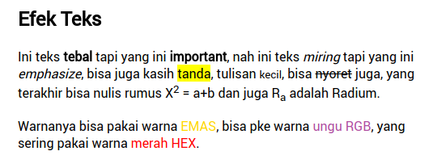
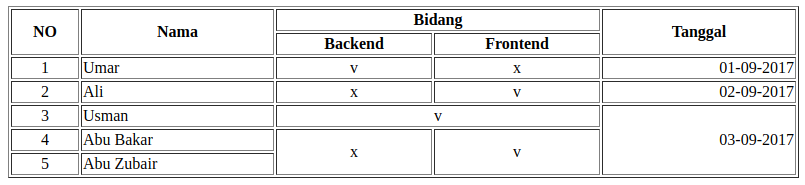
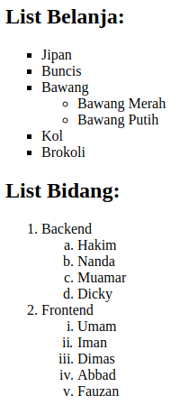
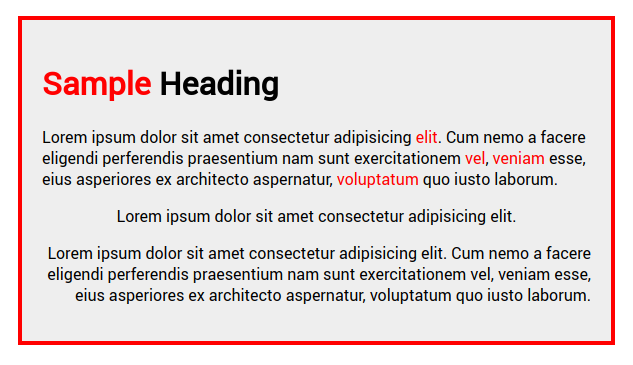

# TUGAS 1 WEB BASIC

1. Buat halaman dengan judul _Tugas 1 - HTML_

2. Buat _Heading 1_ dengan konten kepanjangan dari **HTML**

4. Buat link berupa gambar logo google yang mengarah ke `google.com` di-tab baru

4. Buat sebagaimana gambar:

   

5. Buat _quote panjang_ berupa ayat al-quran dari `quran.com`

6. Buat teks komentar dengan konten `ini komentar tidak terlihat`

7. Tampilkan gambar dari `unsplash.com` dengan panjang 500px dan lebar 500px dengan alternatif teks `unsplash.com`

8. Buat sebagaimana gambar:

   

9. Buat sebagaimana gambar:

   

10. Buat sebagaimana gambar:

   

11. Embed peta dari google maps

12. Ubah background halaman menggunakan gambar pattern dari `free-patterns.info`

13. Ubah font halaman menjadi `Roboto` dari google web font

14. Semua _style css_ diatas ditaruh satu file `style.css`

**Catatan:**

Tugas dikumpul saat pertemuan selanjutnya tanggal 12 September 2017.